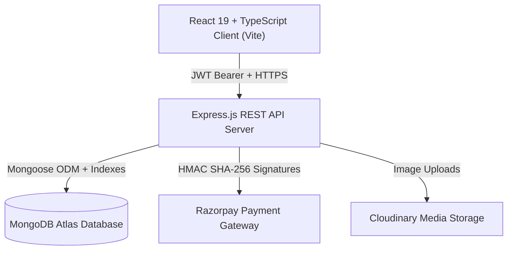

# 🍲 KhanaNow — Hyper-Local Ultra-Fast Food Delivery Platform

[](https://github.com/ravithakur776/KhanaNow/actions/workflows/ci.yml)
[](https://www.typescriptlang.org/)
[](https://react.dev/)
[](https://tailwindcss.com/)
[](https://expressjs.com/)
[](https://www.mongodb.com/)
[](https://razorpay.com/)

> **KhanaNow** is an end-to-end, production-grade food delivery ecosystem engineered with the design elegance of Apple & Airbnb, and the financial reliability of Stripe. Built with React 19, TypeScript, Express, MongoDB Atlas, and Razorpay.

---

## 🏛️ System Architecture



---

## 🚀 Key Engineering Challenges Solved (Portfolio Highlights)

### 1. Server-Authoritative Pricing & Cart Integrity
* **Challenge**: Preventing client-side payload tampering where users maliciously adjust item prices, delivery fees, discount values, or tax rates before checkout.
* **Solution**: The server recalculates and validates every line item, active coupon rules (e.g. `KHANA50`), delivery thresholds, platform fees, and taxes from the live database. Any discrepancy results in `400 PAYMENT_AMOUNT_MISMATCH`.

### 2. Razorpay Signature Verification & Idempotency
* **Challenge**: Preventing duplicate order charges and forged payment confirmations.
* **Solution**: Server computes HMAC-SHA256 signature `crypto.createHmac('sha256', secret).update(order_id + '|' + payment_id).digest('hex')` and verifies exact equality. Payment records enforce unique idempotency keys.

### 3. Strict Restaurant & Order Ownership Isolation
* **Challenge**: Multi-tenant security where Restaurant Owner A attempts to view or update orders belonging to Restaurant Owner B.
* **Solution**: Server-side authorization checks `order.restaurantId.toString() === authenticatedOwnerRestaurantId`. Unauthorized cross-kitchen access returns `403 FORBIDDEN`.

### 4. Immutable Order Snapshots
* **Challenge**: If a restaurant alters a dish price or deletes a menu item tomorrow, historical receipts and accounting records must not change.
* **Solution**: Orders store a complete, immutable snapshot of food details, prices at the time of purchase, tax calculations, and delivery addresses.

### 5. Deterministic Notification Triggers
* **Challenge**: Preventing duplicate push/in-app notifications during network retries on order lifecycle milestones.
* **Solution**: Notifications use unique deterministic sparse keys (e.g. `ORDER_CONFIRMED:KN-20260808-8F4K2`). Duplicate triggers are safely ignored by database index constraints.

### 6. Server-Derived Verified Purchase Reviews
* **Challenge**: Preventing review spam and fake verified customer claims.
* **Solution**: `isVerifiedPurchase: true` is strictly calculated server-side by verifying that the reviewer completed and received a `DELIVERED` order from that restaurant. Compound unique indexes prevent duplicate reviews for the same order.

---

## 📱 User Flows

### Customer Flow
1. **Discovery**: Search kitchens, filter by cuisine (`Biryani`, `Pizza`, `North Indian`), view ratings, and dietary preferences (`Veg` / `Non-Veg`).
2. **Cart & Coupons**: Add dishes to cart, validate coupons (`KHANA50`, `WELCOME100`), and review live bill summary.
3. **Address & Delivery**: Select saved addresses or add geolocation-tagged delivery points.
4. **Payment**: Secure Razorpay modal checkout with server signature confirmation.
5. **Live Tracking**: Step-by-step order lifecycle progress (`PLACED` → `CONFIRMED` → `PREPARING` → `READY` → `OUT_FOR_DELIVERY` → `DELIVERED`).
6. **Reviews & Recommendations**: Leave verified purchase reviews and receive honest personalized recommendations (`Order Again`, `Popular Near You`).

### Restaurant Owner Flow
1. **Live Dashboard**: View daily GMV, incoming orders, and kitchen status.
2. **Order Management**: Transition orders from `CONFIRMED` to `PREPARING` and `READY`.
3. **Menu Management**: Add signature dishes with categories, pricing, images, and toggle instant item availability (`Available` / `Sold Out`).

### Platform Admin Flow
1. **Platform Analytics**: Total revenue, platform fees, active restaurant count, and customer metrics.
2. **Moderation**: Review flagged customer feedback and monitor platform audit logs.

---

## 🛠️ Tech Stack

| Layer | Technologies |
| :--- | :--- |
| **Frontend** | React 19, TypeScript, Vite, Tailwind CSS, Lucide React, Framer Motion, TanStack Query, Zustand, React Hook Form, Zod |
| **Backend** | Node.js, Express.js, TypeScript, Mongoose ODM, JWT Authentication, Bcrypt.js, Express Rate Limit, Helmet, Morgan |
| **Database** | MongoDB Atlas with compound indexes, Geospatial 2dsphere indexes, and aggregation pipelines |
| **Payments** | Razorpay SDK, HMAC-SHA256 Webhook Verification |
| **Testing** | Node.js TSX automated test suite verifying password hashing, pricing integrity, payment security, and ownership isolation |

---

## ⚙️ Local Development Setup

### 1. Clone the repository
```bash
git clone https://github.com/ravithakur776/KhanaNow.git
cd KhanaNow
```

### 2. Backend Setup
```bash
cd server
npm install
cp .env.example .env
# Fill in your MongoDB Atlas URI, JWT Secrets, and Razorpay Keys in .env
npm run dev
```

### 3. Frontend Setup
```bash
cd ../client
npm install
cp .env.example .env
npm run dev
```
Open [http://localhost:5173](http://localhost:5173) in your browser.

---

## 🌱 Database Seeding (Test Credentials)

To seed the database with signature dishes, categories, coupons, and test accounts:
```bash
cd server
npx tsx src/scripts/seed.ts
```

| Role | Email | Password |
| :--- | :--- | :--- |
| **Customer** | `customer@khananow.com` | `Password123!` |
| **Restaurant Owner** | `owner@khananow.com` | `Password123!` |
| **Platform Admin** | `admin@khananow.com` | `Password123!` |

---

## 🧪 Automated Testing

Run the full production hardening and security test suite:
```bash
cd server
npx tsx src/utils/production.test.ts
```

Output:
```text
🧪 Starting KhanaNow Production Hardening & Security Test Suite...

✅ PASS: Password hash uses strong bcrypt algorithm ($2a/$2b)
✅ PASS: Bcrypt accurately verifies correct password
✅ PASS: Bcrypt strictly rejects incorrect password
✅ PASS: Server calculates exact item subtotal (820)
✅ PASS: Discount accurately capped to max discount rule (100)
✅ PASS: Free delivery granted for orders over threshold (> ₹499)
✅ PASS: Grand total matches server-authoritative bill breakdown (781)
✅ PASS: Generated HMAC-SHA256 signature is valid 64-char hex
✅ PASS: HMAC signature changes when payload is tampered
✅ PASS: Customer A can view their own order
✅ PASS: Customer B is blocked from viewing Customer A order
✅ PASS: Restaurant 1 can process order assigned to Kitchen 1
✅ PASS: Restaurant 2 is strictly blocked from updating Kitchen 1 order
✅ PASS: Deterministic event keys match for repeated status triggers
✅ PASS: Distinct order lifecycle milestones generate unique event keys

========================================
🎉 Test Results: 15/15 Passed (100% Success Rate)
========================================
```

---

## 🌐 Production Deployment

### Frontend (Vercel)
1. Push repository to GitHub.
2. Import repository in [Vercel Dashboard](https://vercel.com).
3. Set root directory to `client`.
4. Add environment variables:
   - `VITE_API_URL`: `https://your-backend-railway.app/api/v1`
   - `VITE_RAZORPAY_KEY_ID`: `rzp_live_...`
5. Deploy. (SPA rewrites and security headers are handled automatically by `client/vercel.json`).

### Backend (Railway / Render)
1. Import repository on [Railway](https://railway.app).
2. Set root directory to `server`.
3. Set build command: `npm run build` and start command: `npm start`.
4. Configure environment variables (`MONGODB_URI`, `JWT_ACCESS_SECRET`, `JWT_REFRESH_SECRET`, `CLIENT_URL`, `RAZORPAY_KEY_ID`, `RAZORPAY_KEY_SECRET`).
5. Verify health check at `https://your-backend.app/health`.

---

## 📄 License
This project is licensed under the MIT License.
